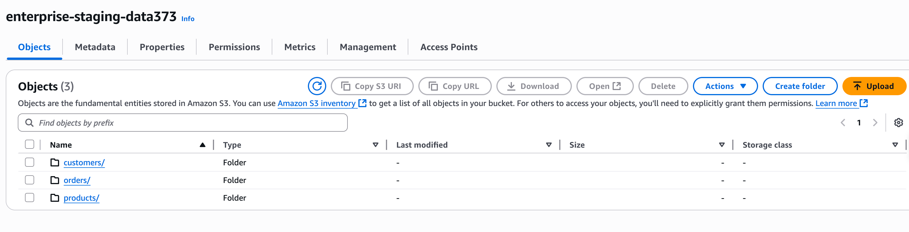
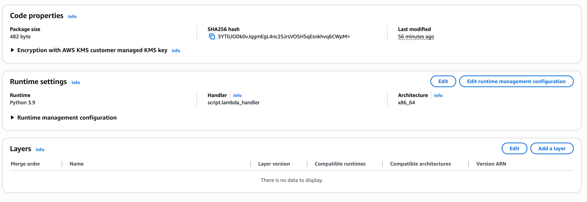
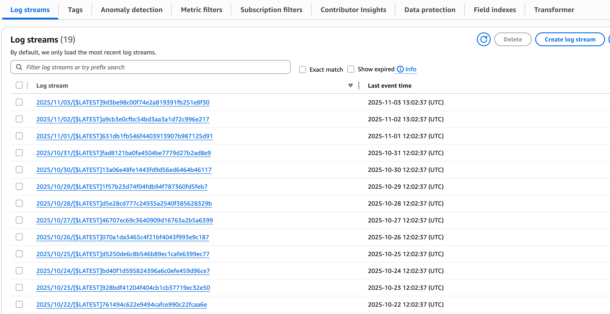
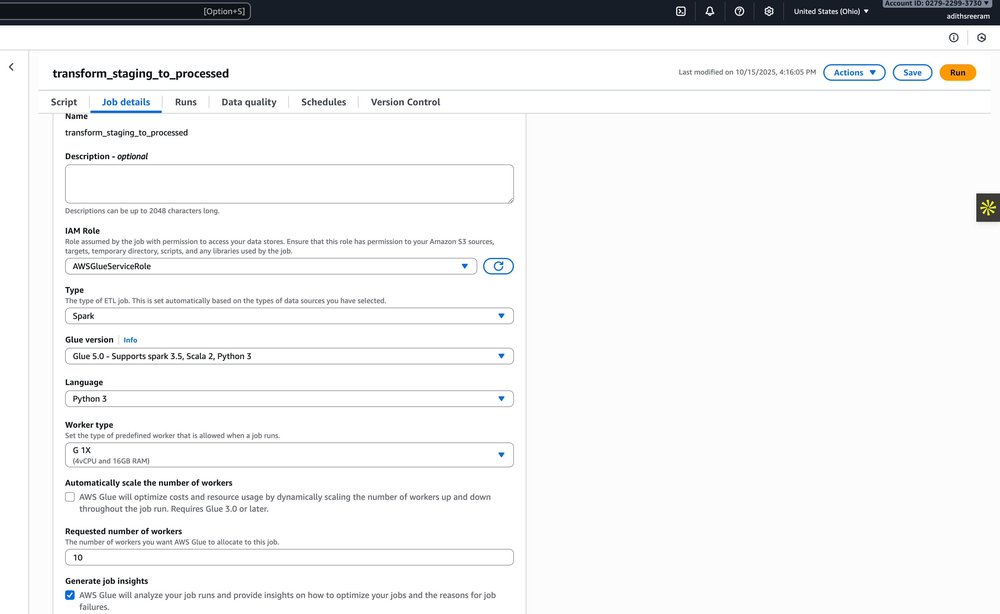
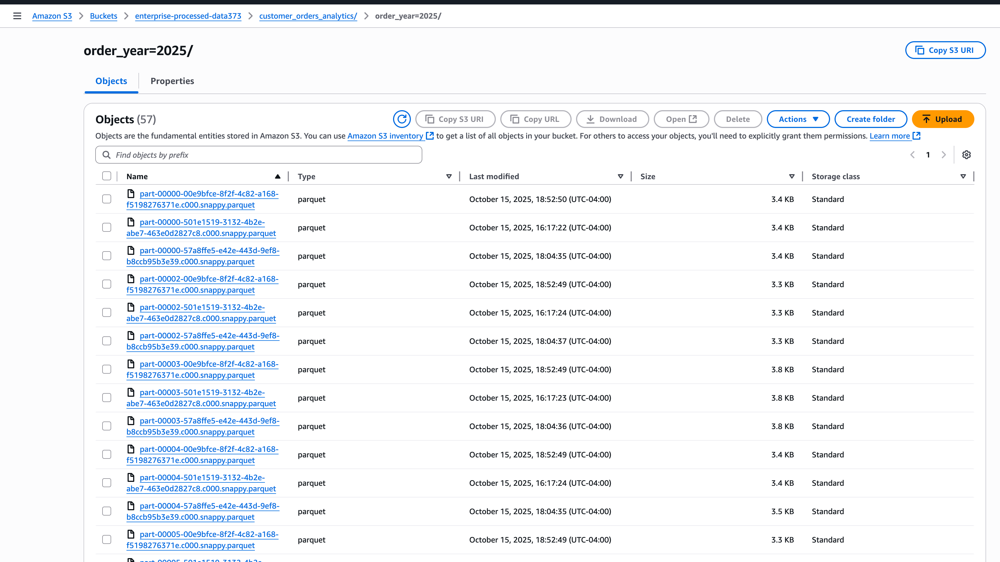
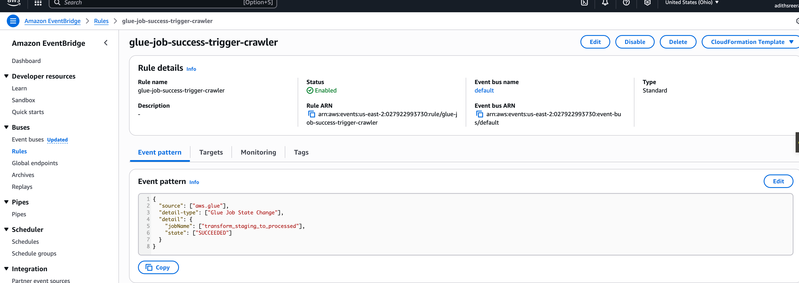
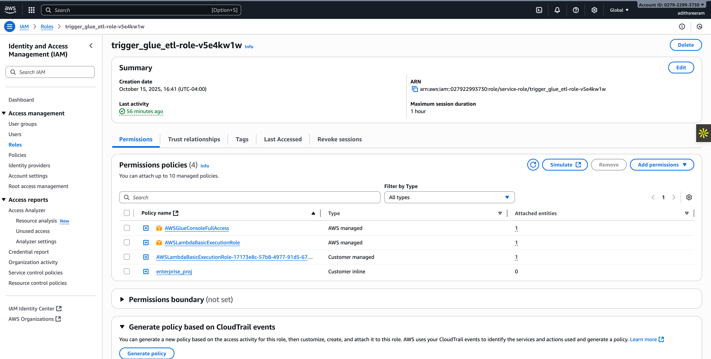
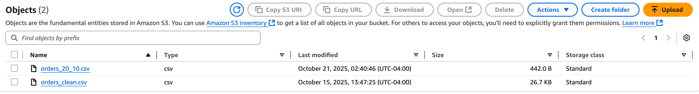

# 🧭 AWS ETL Pipeline – Enterprise Analytics

### 🚀 End-to-End Serverless Data Engineering Project

This project demonstrates a **fully automated, serverless ETL (Extract–Transform–Load) pipeline** built entirely on **AWS**.  
It ingests raw data into S3, transforms it using **AWS Glue**, orchestrates automation through **Lambda** and **EventBridge**, catalogs processed data with a **Glue Crawler**, and enables analytics directly from **Athena** — all with real-time monitoring and alerts.

<p align="center">
  
</p>

---

## 🌐 Architecture Overview

<p align="center">
  
</p>

### **Pipeline Flow**

S3 (staging upload)

↓ triggers

Lambda (trigger_glue_etl)

↓

AWS Glue ETL Job (transform_staging_to_processed)

↓

S3 (processed - Parquet output)

↓

EventBridge → Lambda (trigger_glue_crawler)

↓

Glue Crawler → Data Catalog

↓

Athena SQL Queries / BI Dashboards

↓

CloudWatch + SNS → Monitoring & Alerts


---

## ⚙️ Tools & Technologies Used

| Category | Services / Tools |
|-----------|------------------|
| **Cloud Platform** | AWS |
| **Storage** | Amazon S3 |
| **ETL Engine** | AWS Glue (PySpark) |
| **Orchestration** | AWS Lambda, EventBridge |
| **Catalog & Query** | AWS Glue Crawler, AWS Athena |
| **Monitoring** | Amazon CloudWatch, Amazon SNS |
| **Automation / Scheduling** | EventBridge Rules |
| **Language** | Python 3 |
| **Data Format** | CSV → Parquet (partitioned by year) |

---

## 🧱 Repository Structure

data_sample/ → raw/staging CSV datasets

docker/ → Docker placeholders for future containerization

docs/ → documentation and screenshots

src/ → all pipeline scripts (ETL, Lambda, etc.)

requirements.txt → dependencies (boto3, pandas)

README.md → project overview (this file)


---

## 📂 Data Flow Breakdown

### 🪣 **1. S3 – Data Ingestion Layer**
- Bucket: `enterprise-staging-data373`
- Contains raw data for:
  - Customers  
  - Orders  
  - Products  
- Uploading a new file here automatically triggers the pipeline.

<p align="center">
  
</p>

---

### ⚡ **2. Lambda – Orchestration Trigger**

- **Function:** `trigger_glue_etl`
- **Purpose:** Starts the Glue ETL job when new data lands in S3.  
- Configured with an **S3 event trigger** (`s3:ObjectCreated:*`)  
- Uses **least-privilege IAM policy** to call Glue safely.

<p align="center">
  
</p>

**Lambda execution log (CloudWatch):**
<p align="center">
  
</p>

---

### 🔄 **3. AWS Glue – ETL Transformation**

- **Job name:** `transform_staging_to_processed`
- **Language:** PySpark (AWS Glue script)
- Reads customers, orders, products from staging → cleans → joins → adds:
  - `extended_price = ordered_quantity × standard_price`
  - `order_year` for partitioning
- Writes transformed Parquet files to:

#### s3://enterprise-processed-data373/customer_orders_analytics/

Partitioned by `order_year`.

<p align="center">

</p>

**Sample job run success:**
<p align="center">

</p>

---

### 📊 **4. S3 – Processed Data (Analytics Layer)**

Processed, partitioned Parquet files stored here:  

#### s3://enterprise-processed-data373/customer_orders_analytics/

<p align="center">
  
</p>

---

### 📇 **5. AWS Glue Crawler – Data Catalog**

- **Crawler name:** `processed_customer_orders_crawler`
- Scans processed Parquet data and registers the schema in the **Glue Data Catalog**.
- Automatically refreshes via **EventBridge** after every successful Glue ETL run.

<p align="center">
  
</p>

**Table schema created by crawler:**
<p align="center">
  
</p>

---

### 🧩 **6. EventBridge – Automation Backbone**

Two key rules:
1. **ETL Scheduler:** Runs Glue ETL daily (or hourly).  
2. **ETL Success → Trigger Crawler:** Automatically refreshes catalog after ETL success.

<p align="center">
  
</p>

**Crawler trigger on job success:**
<p align="center">
  
</p>

**Event execution log:**
<p align="center">
  
</p>

---

### 🧠 **7. Athena – Serverless Analytics**

- Athena queries Parquet data from processed S3 bucket via Glue Data Catalog.
- Sample Queries:

```sql
-- Preview
SELECT * FROM enterprise_analytics_db.customer_orders_analytics LIMIT 10;

-- Revenue by Region
SELECT region, SUM(extended_price) AS total_revenue
FROM enterprise_analytics_db.customer_orders_analytics
GROUP BY region
ORDER BY total_revenue DESC;

-- Yearly Sales Trend
SELECT order_year, SUM(extended_price) AS total_sales
FROM enterprise_analytics_db.customer_orders_analytics
GROUP BY order_year
ORDER BY order_year;
```

Sample query results:

<p align="center">    </p>

### 🕕 8. Scheduled Run (Fully Automated)

- EventBridge triggers ETL daily.

- Glue job executes, processes data.

- Crawler refreshes catalog automatically.

- Athena reflects new data instantly.

- Successful scheduled pipeline:

<p align="center">  </p>

### 🔔 9. Monitoring & Alerts

CloudWatch Alarms monitor:

Glue job failures (JobRunFailed ≥ 1)

Lambda errors (Errors ≥ 1)

SNS Topic: enterprise-pipeline-alerts

Sends real-time email notifications for any failure.

<p align="center">  </p>

### 10. 📈 Athena – Updated Query After New Data

- When new data is uploaded or the schedule runs, Athena instantly reflects the latest records.

- Before and after comparison:

<p align="center">  </p>

### 11. 🧾 Key Learnings & Takeaways

- Designed a fully serverless, event-driven ETL pipeline using AWS native services.

- Implemented least privilege IAM roles for Lambda and Glue.

- Automated ETL + catalog refresh + daily scheduling via EventBridge.

- Transformed and stored optimized Parquet data.

- Enabled Athena as a cost-efficient serverless analytics layer.

- Added CloudWatch monitoring and SNS alerts for reliability.

### 12. 🧰 Future Enhancements

- Integrate Amazon QuickSight for visual dashboards.

- Add data validation using AWS Deequ or Great Expectations.

- Containerize ETL jobs for hybrid environments (Docker + Airflow).

- Add API Gateway + Lambda endpoint to trigger manual refreshes.
